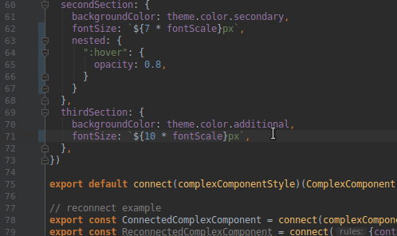

# fela-plugin-embedded

  <a href="https://bundlephobia.com/result?p=fela-plugin-typescript@latest"></a>

This plugins allows you to write type-safe style rules and provides some autocomplete for you:



## Installation
```sh
yarn add fela-plugin-typescript
```
You may alternatively use `npm i --save fela-plugin-typescript`.

## Usage
Make sure to read the documentation on [how to use plugins](http://fela.js.org/docs/advanced/Plugins.html).

```javascript
import { createRenderer } from 'fela'
import typescript from 'fela-plugin-typescript'

const renderer = createRenderer({
  plugins: [ typescript() ]
})
```

## Example
#### Input
```javascript
{
  color: 'red',
  width: 5,
  nested: {
    ':last-child': {
      padding: 10,
      height: 5,
    },
  },
}
```
#### Output
```javascript
{
  color: 'red',
  width: 5,
  ':last-child': {
    padding: 10,
    height: 5,
  },
}
```

## FAQ
#### Why use additional prop "nested"?
In Typescript you can't declare a simple property and indexed property with different types of values in single type. For example it will not work:  
```typescript
type IStyle = {
    padding?: number; // <-- Error: Property 'padding' of type 'number' 
                      // is not assignable to string index type 'IStyle'.
    [selector: string]: IStyle
}
```
So the "nested" property is a tricky way to provide type-safety of Fela rules.

## License
Fela is licensed under the [MIT License](http://opensource.org/licenses/MIT).<br>
Documentation is licensed under [Creative Common License](http://creativecommons.org/licenses/by/4.0/).<br>
Created with ♥ by [@rofrischmann](http://rofrischmann.de) and all the great contributors.
